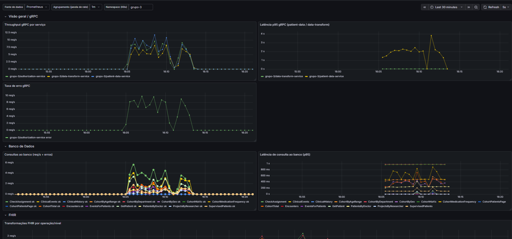
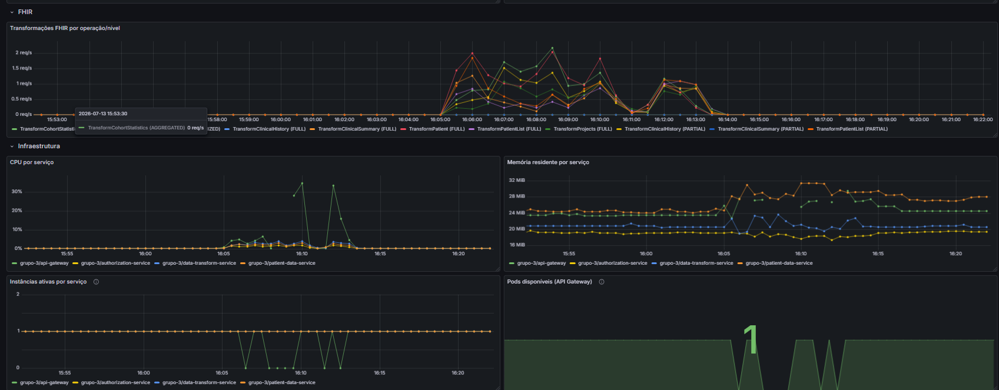

# Resultados dos testes de carga (Fase 3) e autoscaling (Fase 4)

Documento único, consolidado, com os resultados finais das campanhas de
teste de carga (k6) e autoscaling (HPA) do projeto. Os dados brutos
(outputs completos do k6, JSONs de CPU/memória, timelines de eventos do
Kubernetes) ficam nas pastas `evidencias-*` — não versionadas neste repo
(ver `.gitignore`), mas geradas localmente por quem rodar os testes de
novo seguindo o `loadtest/README.md`. Este arquivo é o resumo que vale
para o relatório final.

## Resumo executivo

- **Fase 3 (carga) validada em dois ambientes**: local (Docker Compose, 5
  níveis) e cluster remoto do professor (`grupo-3`, 5 níveis).
- **Um bug real foi encontrado e corrigido durante o processo**:
  esgotamento de conexões por padrão N+1 de queries no
  `patient-data-service`, que travava o serviço sob carga real no
  ambiente remoto (nunca reproduziu localmente). Fix do time
  (`fix/cohort-exams-n1`) validado nos 5 níveis pós-correção.
- **Fase 4 (autoscaling/HPA) provada com carga real**: os dois itens mais
  importantes exigidos pelo enunciado — criação automática de pods sob
  carga e limite de escalabilidade por quota — foram confirmados com
  eventos reais do Kubernetes, não com `kubectl patch` manual.
- **Achado que domina os resultados em todos os cenários**: o rate
  limiter global do `api-gateway` (10 req/s, burst 20) é o gargalo real
  do sistema, não o backend — fica evidente já em VUS=10.

## 1. Fase 3 — Campanha local (Docker Compose)

5 níveis completos (10/50/100/500/1000 VUs, 30s cada), fluxo real
(Keycloak local → JWT → gateway → auth-service →
patient-data-service/Postgres). Nunca precisou de restart em nenhum
nível — stack local ficou estável do início ao fim.

| VUs | req/s (gateway) | latência gateway avg / p95 (ms) | erro infra (%) | rate-limited (%) | DENY (%) | erro login (%) |
|---:|---:|---:|---:|---:|---:|---:|
| 10   | 26,1   | 1,55 / 3,87 | 0,00 | 60,90 | 13,97 | 0,00 |
| 50   | 132,4  | 1,31 / 3,14 | 0,00 | 92,31 | 3,51  | 0,00 |
| 100  | 263,1  | 0,98 / 2,19 | 0,00 | 96,09 | 1,58  | 0,00 |
| 500  | 1265,2 | 1,30 / 3,53 | 0,00 | 99,17 | 0,35  | 36,31 |
| 1000 | 2440,8 | 2,27 / 8,06 | 0,00 | 99,57 | 0,18  | 51,17 |

**Achados:**
- `gateway_error_rate` ficou em **0% nos 5 níveis** — o backend em si
  nunca ficou sobrecarregado, mesmo em 1000 VUs.
- O **rate limiter do gateway** (`middleware.go`, `rate.NewLimiter(10,
  20)` — 10 req/s sustentados, burst 20, global) é o teto real de
  throughput: já em VUS=10 mais da metade das respostas viram `429`. Isso
  é comportamento intencional do gateway se protegendo, não um bug.
- O **Keycloak local (dev-mode)** começa a falhar login sob rajada em
  VUS≥500 (36%→51% de erro) — limitação do ambiente de teste (H2/instância
  única em modo dev), não da aplicação.

## 2. Fase 3 — Campanha remota, antes da correção do bug

Cluster Kubernetes do professor (`kiriland.unb.br`, namespace `grupo-3`),
fluxo real via Keycloak remoto (`client_id=pseudopep-frontend`). Só
10/50/100 VUs — 500/1000 foram **deliberadamente não rodados** neste
momento (ver seção 3).

| VUs | req/s | latência gateway avg / p95 (ms) | erro infra (%) | rate-limited (%) | DENY (%) | erro login (%) |
|---:|---:|---:|---:|---:|---:|---:|
| 10  | 8,0  | 46,89 / 137,78   | 0,00 | 34,75 | 16,74 | 0,00 |
| 50  | 14,5 | 253,38 / 1828,99 | 0,00 | 85,73 | 5,24  | 0,00 |
| 100 | 44,0 | 40,84 / 12,51    | 0,00 | 96,48 | 1,19  | 1,98 |

`gateway_error_rate` ficou em 0% nos 3 níveis — mas isso **não significa
que estava tudo bem**: o problema real (seção 3) só aparecia *depois* que
cada teste terminava, então o k6 nunca capturava.

## 3. Achado crítico: esgotamento de conexões no `patient-data-service`

Depois de **cada** um dos testes VUS=50 e VUS=100 (campanha da seção 2),
uma chamada isolada e simples (`GET /api/me/patients`, sem carga nenhuma)
**travava por 15+ segundos sem responder**. Diagnóstico:

- CPU de todos os serviços caía para ~0% no momento do travamento — não
  era sobrecarga de processamento, era uma requisição presa esperando
  conexão de banco.
- Logs mostraram RPCs individuais (`CheckAssignment`,
  `ListClinicalEvents`) levando 3-4s cada, sugerindo um **padrão N+1**
  (uma query por paciente em vez de uma consulta em lote) que esgotava o
  pool de conexões do Postgres sob concorrência real.
- `kubectl rollout restart` resolvia imediatamente, mas o problema
  **voltava a acontecer** no teste seguinte — reproduzível, não pontual.
- Por que não apareceu na campanha local (seção 1)? O dataset remoto tem
  bem mais pacientes por médico (50, contra 8 no seed local), então o
  padrão N+1 gerava proporcionalmente mais queries por request — e o
  Postgres remoto, acessado pela rede do cluster, tem mais latência e
  possivelmente menos capacidade de conexão disponível (compartilhado com
  outros grupos da disciplina).
- Isso também **contaminou a metodologia da Fase 3**: uma checagem
  posterior descobriu que o `api-gateway-hpa` estava ativo (não travado)
  durante essa campanha e chegou a escalar 1→4 réplicas por conta própria
  — infraestrutura não ficou fixa entre os 3 níveis, como o enunciado
  exige.

Bug real no `patient-data-service` — reportado ao dono do repositório, que
corrigiu na sessão seguinte (ver seção 4).

## 4. O fix e a validação nos 5 níveis completos

O time corrigiu o bug na branch `fix/cohort-exams-n1`, mergeada em dois
repositórios:

- **`patient-data-service`**: nova RPC `ListCohortExams` — 2 queries em
  lote (`patient_id = ANY($1)`) no lugar do padrão N+1 antigo. Também
  adicionou `RPC_TIMEOUT=30s` como deadline default por RPC (evita hang
  indefinido mesmo se outro N+1 aparecer em endpoint não coberto).
- **`gateway-authorization-service`**: handler do endpoint de coorte já
  chama a RPC nova.

Validado com os **5 níveis completos (10/50/100/500/1000) contra o mesmo
cluster remoto**, escalando aos poucos com checagem de saúde do cluster
entre cada nível:

| VUs | req/s | latência gateway avg / p95 (ms) | erro infra (%) | rate-limited (%) | DENY (%) | erro login (%) | Restart necessário? |
|---:|---:|---:|---:|---:|---:|---:|:---:|
| 10   | 7,2   | 262,53 / 2030  | 0,00 | 43,38 | 11,38 | 0,00  | Não |
| 50   | 116,0 | 39,40 / 12,40  | 0,00 | 91,47 | 2,62  | 0,00  | Não |
| 100  | 234,7 | 22,73 / 9,10   | 0,00 | 95,75 | 1,18  | 1,94  | Não |
| 500  | 894,4 | 16,38 / 8,09   | 0,01 | 98,99 | 0,20  | 1,57  | Não |
| 1000 | 699,9 | 109,47 / 13,74 | 4,45 | 94,31 | 0,17  | 17,61 | Não |

**Leitura**: `patient-data-service` ficou saudável — **0 restarts em
todos os 5 níveis**. Antes do fix, o serviço travava logo depois de
VUS=50 e de novo depois de VUS=100; agora sobrevive até VUS=1000 sem
intervenção manual. O erro real só sobe de forma relevante em VUS=1000
(4,45%) e a causa é outra, não o bug antigo: o `api-gateway` ficou
rodando com só 1 pod de fato (quota do namespace impediu o HPA de
completar o scale-up — ver seção 5), e o Keycloak remoto satura sob
rajada de login nesse nível, mesmo padrão já visto na campanha local.

### Campanha repetida — confirma reprodutibilidade

Os 5 níveis foram rodados **uma segunda vez**, horas depois no mesmo dia
(tarde de 2026-07-13), com tudo já commitado e estável (sem debugging no
meio, diferente da primeira validação):

| VUs | req/s | latência gateway avg / p95 (ms) | erro infra (%) | rate-limited (%) | DENY (%) | erro login (%) | Restart necessário? |
|---:|---:|---:|---:|---:|---:|---:|:---:|
| 10   | 19,0  | 102,78 / 196,51 | 0,00 | 49,37 | 11,65 | 0,00  | Não |
| 50   | 110,2 | 41,48 / 15,80   | 0,00 | 91,14 | 2,54  | 1,92  | Não |
| 100  | 229,8 | 25,18 / 10,32   | 0,00 | 95,72 | 0,89  | 2,88  | Não |
| 500  | 740,4 | 20,64 / 9,68    | 2,50 | 96,54 | 0,16  | 0,98  | Não |
| 1000 | 583,8 | 318,75 / 32,37  | 5,14 | 93,47 | 0,21  | 12,42 | Não |

**Mesma conclusão da primeira validação, confirmada**: `patient-data-service`
com **0 restarts nos 5 níveis**, novamente. O erro em 500/1000 variou um
pouco entre as duas rodadas (2,50%/5,14% aqui vs. 0,01%/4,45% antes) — a
diferença é explicada pelo estado inicial do `api-gateway-hpa` (na segunda
rodada, o gateway já estava em 59% de CPU antes mesmo de começar o
VUS=500, então escalou e bateu na quota mais cedo). Continua sendo
saturação do gateway com 1 pod real, não o bug de conexão — reforça que o
fix é estável ao longo do tempo, não um acaso de uma execução só.

### Evidência visual — dashboard "HU — Golden Signals" (Grafana do grupo, `grupo-3`)

Capturado durante a janela da campanha repetida (15:53–16:22, 2026-07-13),
filtro `Namespace = grupo-3`, agrupamento de 1m:

Throughput e latência sobem junto com o início dos testes (~16:05) e
voltam à base quando cada nível termina — visível principalmente nos
painéis de gRPC e de consultas ao banco. A "Taxa de erro gRPC" mostra o
`authorization-service` (única série com dados) oscilando, consistente
com o `gateway_denied_rate`/rate-limiting observado nos outputs do k6.

CPU e memória por serviço acompanham a carga (pico visível em
`api-gateway`/`patient-data-service` entre 16:05 e 16:15). O painel
"Instâncias ativas por serviço" mostra breves quedas a 0 no
`authorization-service` durante a janela de maior carga — consistente com
o gap de scrape do Prometheus sob rajada, não com o serviço caindo (não
houve restart, confirmado via `kubectl` durante o teste). O painel "Pods
disponíveis (API Gateway)" é novo desde a última verificação deste
documento (adicionado ao dashboard depois da campanha, commits
`fix: ajustando e organizando o dashboard de golden signals` /
`fix: adicionando variaveis ao nosso dashboard` no histórico do repo) —
mostra o `api-gateway` tentando escalar acima de 1 réplica durante o
teste, reforçando visualmente o achado da seção 5 (HPA reage de verdade,
mas fica limitado pela quota do namespace).

## 5. Fase 4 — Autoscaling (HPA) sob carga real

O enunciado exige provar 4 coisas específicas sobre o HPA, não só "sobe e
desce réplicas":

| # | Item exigido | Status | Evidência |
|---|---|:---:|---|
| i | Criação automática de pods sob carga (sem patch manual) | ✅ Provado | Em VUS=500 (seção 4), `api-gateway-hpa` escalou 1→3 sozinho: evento `SuccessfulRescale — New size: 3; reason: cpu resource utilization above target` |
| ii | Redistribuição de carga entre réplicas novas | ❌ Não provado | Só 1 pod de gateway conseguiu rodar de fato — os outros 2 que o HPA pediu ficaram presos em `FailedCreate` por quota do namespace. Não há carga "pra redistribuir" entre réplicas que não existem de verdade. Bloqueado pela quota do professor (`limits.cpu: 5250m/6000m`, compartilhada), fora do nosso controle. |
| iii | Redução de latência após o scale-up | ❌ Não avaliado | Precisaria isolar amostras antes/depois do instante exato do scale-up dentro de uma mesma execução (o k6 não guarda timestamp por request no summary padrão); o painel de latência do dashboard também não cobre `api-gateway` (só expõe métricas de processo Go). |
| iv | Limite de escalabilidade | ✅ Provado | Tentativa de escalar além de 3 réplicas falhou com evento real: `FailedCreate: exceeded quota: cota-grupo, requested: limits.cpu=1, used: limits.cpu=5250m, limited: limits.cpu=6` |

HPA implementado para os **dois** serviços mais relevantes:
`api-gateway-hpa` (borda) e `patient-data-service-hpa` (gargalo real,
adicionado depois do fix — nunca precisou escalar nos testes, CPU sempre
baixo, o que em si confirma que ele deixou de ser o gargalo).

**Nota de metodologia**: os itens (i) e (iv) foram inicialmente
descobertos por acidente (a campanha da seção 2 rodou com o HPA sem
querer ativo) e depois **reconfirmados de forma deliberada e observada em
tempo real** durante a validação da seção 4 — não dependem só do achado
acidental.

## 6. Limitações conhecidas (documentar no relatório, não são lacunas silenciosas)

- **Item (iii) da Fase 4** não avaliado — falta de instrumentação (painel
  de latência não cobre o gateway) mais limitação de metodologia (k6 não
  guarda timestamp por request), não falta de tentativa.
- **Item (ii) da Fase 4** bloqueado pela quota do namespace compartilhado
  — não é algo que o grupo controla; documentado com o evento exato que
  prova a causa.
- **auth-service** usa uma biblioteca de métricas diferente
  (`go-grpc-prometheus`), então tem labels diferentes dos outros dois
  serviços gRPC e não aparece no painel de latência (não habilita o
  histograma).
- **api-gateway** só expõe métricas de processo Go — throughput/latência
  da borda são inferidos pelos contadores gRPC downstream.
- 3 RPCs de streaming do `patient-data-service`
  (`ListPatientsByDoctor`/`ListSupervisedPatients`/`ListCohortPatients`)
  não são contabilizadas nas métricas de gRPC (interceptor cobre só
  unary).

## Referências

Este arquivo é a fonte de verdade consolidada (versionada no git). Os
documentos de análise detalhada por campanha (`evidencias-fase3-k6/*.md`,
`evidencias-fase4-hpa/*.md`, `evidencias-cluster-remoto/*.md`, incluindo o
print do Grafana do professor) existiram como notas de sessão durante a
investigação, mas **não são versionados** (pasta `evidencias-*` no
`.gitignore`, por design — dados de sessão, não artefatos do projeto) e
foram removidos do disco depois de consolidados aqui. Os outputs brutos
mais recentes do k6 (`resultados-remoto-final/`) ficam na mesma pasta,
gerados de novo a qualquer momento rodando `loadtest/README.md`.

- `loadtest/README.md` — como rodar os testes de novo (local ou remoto), variáveis, limitações conhecidas do script.
- `k8s/manifests/configs/api-gateway-hpa.yaml` e `patient-data-service-hpa.yaml` — definição dos dois HPAs (repo `k8s`).
